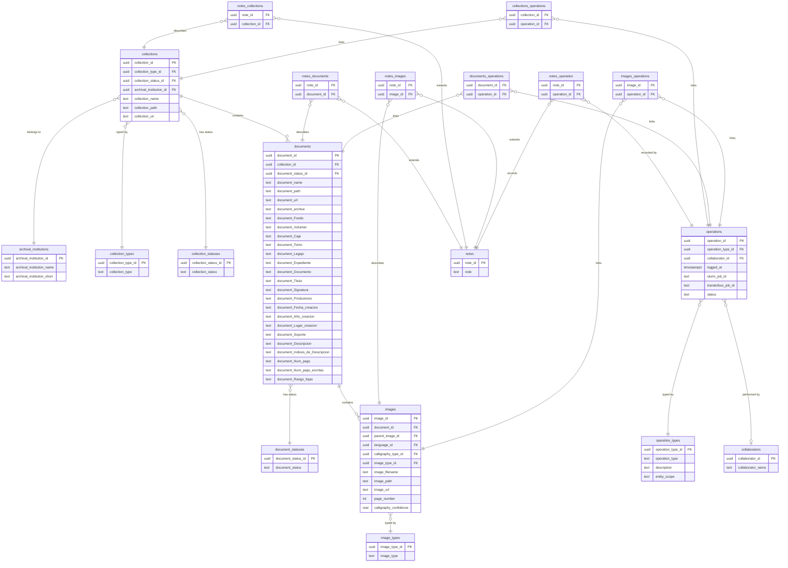

![[visualization/webcontent/amoxcailab.domain/assets/excalidraw/data_model.excalidraw]]

## Diagrama ER — scope de ingestión

Representación mínima en texto del modelo de datos. La referencia visual primaria es el archivo excalidraw.



---

## Catálogo de tablas

### Entidades principales

| Tabla | Propósito |
|---|---|
| `collections` | Colección documental (una serie de una institución archivística) |
| `documents` | Documento individual dentro de una colección (expediente, volumen, manuscrito) |
| `images` | Imagen / página de un documento |
| `collaborators` | Personas que realizan operaciones en el pipeline |
| `notes` | Notas que extienden la descripción de collections, documents o images |
| `operations` | Registro central de cada acción realizada en el pipeline |
| `htr` | Transcripción generada por Transkribus para una imagen |
| `ground_truth` | Transcripción corregida (referencia) vinculada a un HTR |
| `hist_clean` | Versión histórica limpia (output de spanish_historical_clean) |
| `clean_modern` | Versión modernizada (output de spanish_clean_modern) |
| `models` | Modelos de ML registrados en el proyecto |
| `descriptive_analysis` | Métricas de calidad HTR por documento |
| `entities` | Entidades nombradas detectadas en transcripciones |
| `abbreviations` | Abreviaturas detectadas en imágenes |
| `expansions` | Expansiones propuestas para abreviaturas |
| `errors` | Errores HTR identificados por análisis descriptivo |
| `corrections` | Correcciones propuestas para errores |
| `patterns` | Patrones de error recurrentes |

### Catálogos / lookup

| Tabla | Contiene |
|---|---|
| `archival_institutions` | AGN, AMP, BP, AGI |
| `collection_types` | AGN, AMP, BP, AGI, corpus_local, ground_truth_collection |
| `collection_statuses` | new, documents_in_queue, ready |
| `document_types` | expediente, volumen, manuscrito, impreso, legajo |
| `document_statuses` | new, htr_available, hist_clean, clean_modern, annotated, nlp_ready |
| `image_types` | original, processed |
| `image_statuses` | registered, preprocessed, layout_sent, htr_available |
| `languages` | spanish_early_modern, spanish_modern, latin, nahuatl, mixed |
| `calligraphy_types` | procesal, humanistica, cortesana, gotica, italiana, mixed, unknown |
| `operation_types` | ver catálogo completo en sección siguiente |
| `roles` | admin, paleographer, researcher, annotator, developer, ml_engineer, project_lead |
| `entity_types` | person, place, institution, date, ship, cargo, currency, office |
| `analysis_types` | htr_baseline, post_historical_clean, post_clean_modern, ground_truth_comparison, human_review |
| `pattern_types` | orthographic, abbreviation, phonetic, morphological, proper_noun |
| `error_type` | substitution, insertion, deletion, transposition, word_boundary, abbreviation_unresolved, entity_unrecognized |
| `expansion_type` | certain, probable, uncertain, contextual |
| `study_cases` | casos de estudio definidos por el equipo |

### Tablas de unión (n:n)

| Tabla | Entidades que conecta |
|---|---|
| `notes_documents` | notes ↔ documents |
| `notes_collections` | notes ↔ collections |
| `notes_images` | notes ↔ images |
| `notes_operation` | notes ↔ operations |
| `collections_operations` | collections ↔ operations |
| `documents_operations` | documents ↔ operations |
| `images_operations` | images ↔ operations |
| `htr_operations` | htr ↔ operations |
| `models_operations` | models ↔ operations |
| `collaborators_roles` | collaborators ↔ roles |
| `documents_document_types` | documents ↔ document_types |
| `documents_study_cases` | documents ↔ study_cases |
| `htr_entities` | htr ↔ entities |
| `entities_entity_types` | entities ↔ entity_types |
| `htr_abbreviations` | htr ↔ abbreviations |
| `abbreviations_expansions` | abbreviations ↔ expansions |
| `htr_errors` | htr ↔ errors |
| `htr_patterns` | htr ↔ patterns |
| `images_image_statuses` | images ↔ image_statuses |

---

## Estados y flujos

### Estados de colección

```
new → documents_in_queue → ready
```

### Estados de documento

```
new → htr_available → hist_clean → clean_modern → annotated → nlp_ready
```

### Estado de imagen

Rastreado en `images_image_statuses` (junction con image_statuses):

```
registered → preprocessed → layout_sent → htr_available
```

### Flujo de operaciones — ingestión inicial

```
collection_registered     ← una vez por colección
  │
  └─[si collection_Notas]─→ note_created
  │
  ├── document_registered  ← una por documento
  │     │
  │     └─[si document_Notas]─→ note_created
  │     │
  │     └── image_registered   ← una por imagen/página
  │
  └── (Fase 2) images_downloaded ← al importar imágenes crudas [ITERACIÓN FUTURA]
```

---

## Arquitectura de notas

- `notes` es una entidad independiente: solo `note_id` y `note`
- **Semántica**: "esta nota extiende la descripción de esta otra entidad"
- Las notas referencian entidades directamente mediante tablas junction:
  - `notes_documents (note_id, document_id)` — nota sobre un documento
  - `notes_collections (note_id, collection_id)` — nota sobre una colección
  - `notes_images (note_id, image_id)` — nota sobre una imagen
- Toda creación o modificación se registra en `notes_operation` con tipo `note_created` o `note_modified`

**Flujo completo al crear una nota de documento:**

1. `notes` ← INSERT `(note_id, "texto")`
2. `notes_documents` ← INSERT `(note_id, document_id)` — referencia directa a la entidad
3. `operations` ← INSERT tipo `note_created` → `operation_id`
4. `notes_operation` ← INSERT `(note_id, operation_id)` — registro del evento

---

## Catálogo de operation_types — scope ingestión

| operation_type | entity_scope | cuándo |
|---|---|---|
| `collection_registered` | collection | Al registrar metadatos de una colección |
| `document_registered` | document | Al registrar un documento con sus campos archivísticos |
| `image_registered` | image | Al registrar una imagen/página |
| `images_downloaded` | collection | Al importar imágenes crudas [ITERACIÓN FUTURA] |
| `note_created` | note | Al crear cualquier nota |
| `note_modified` | note | Al modificar cualquier nota |

---

## Campos por collection_type

| Campo | AGN | AMP | BP | AGI |
|---|:---:|:---:|:---:|:---:|
| document_archive | ✓ | ✓ | ✓ | ✓ |
| document_Fondo | ✓ | ✓ | ✓ | — |
| document_Volumen | ✓ | ✓ | ✓ | — |
| document_Caja | ✓ | — | — | — |
| document_Tomo | — | ✓ | — | — |
| document_Legajo | ✓ | ✓ | — | — |
| document_Expediente | ✓ | — | ✓ | — |
| document_Documento | — | ✓ | — | — |
| document_Titulo | — | — | — | ✓ |
| document_Signatura | — | — | — | ✓ |
| document_Productores | — | — | — | ✓ |
| document_Indices_de_Descripcion | — | — | — | ✓ |
| document_Fecha_creacion | ✓ | ✓ | ✓ | ✓ |
| document_Año_creacion | ✓ | ✓ | ✓ | ✓ |
| document_Lugar_creacion | ✓ | ✓ | ✓ | ✓* |
| document_Soporte | ✓ | — | — | ✓ |
| document_Descripcion | ✓ | ✓ | — | ✓ |
| document_Rango_fojas | ✓ | ✓ | ✓* | — |
| document_Num_pags | ✓* | ✓* | ✓* | ✓* |
| document_Num_pags_escritas | ✓ | ✓ | ✓ | — |

*campo calculado o derivado

`document_Notas` **no es un campo de `documents`**. Cuando aparece en un `.metadata`, se crea como entidad `notes` vinculada directamente al documento via `notes_documents` + operación `note_created`.

---

## Archivos de referencia de datos

| Archivo | Tabla destino |
|---|---|
| `metadata/archival_institutions.csv` | `archival_institutions` |
| `metadata/collection_types.csv` | `collection_types` |
| `metadata/collection_statuses.csv` | `collection_statuses` |
| `metadata/document_statuses.csv` | `document_statuses` |
| `metadata/collections.csv` | `collections` (carga masiva) |
| `metadata/collaborators.csv` | `collaborators` |
| `{collection_dir}/{coleccion}.metadata` | `collections` (registro individual) |
| `{collection_dir}/documentos/{doc}.metadata` | `documents` + `notes` si hay `document_Notas` |

---

## Vistas disponibles

| Vista | Descripción |
|---|---|
| `v_documents_agn` | Documentos AGN con campos relevantes: Fondo, Volumen, Caja, Legajo, Expediente |
| `v_documents_amp` | Documentos AMP con campos relevantes: Fondo, Tomo, Legajo, Documento |
| `v_documents_bp` | Documentos BP con campos relevantes: Fondo, Volumen, Expediente |
| `v_documents_agi` | Documentos AGI con campos relevantes: Titulo, Signatura, Productores, Indices |
| `v_pipeline_status` | Última operación completada por documento |
| `v_quality_metrics` | Métricas promedio de calidad HTR por colección y tipo de análisis |
