![[visualization/webcontent/amoxcailab.domain/assets/excalidraw/data_model.excalidraw]]

## Diagrama ER

Representación en texto del modelo de datos. La referencia visual primaria es el archivo excalidraw.

```mermaid
erDiagram

    %% ── Catálogos / lookup ──────────────────────────────────────────
    archival_institutions {
        uuid archival_institution_id PK
        text archival_institution_name
        text archival_institution_country
    }
    collection_types {
        uuid collection_type_id PK
        text collection_type
    }
    collection_statuses {
        uuid collection_status_id PK
        text collection_status
    }
    document_types {
        uuid document_type_id PK
        text document_type
    }
    document_statuses {
        uuid document_status_id PK
        text document_status
    }
    image_types {
        uuid image_type_id PK
        text image_type
    }
    image_statuses {
        uuid image_status_id PK
        text image_status
    }
    calligraphy_types {
        uuid calligraphy_type_id PK
        text calligraphy_type
    }
    languages {
        uuid language_id PK
        text language
    }
    operation_types {
        uuid operation_type_id PK
        text operation_type_name
    }
    roles {
        uuid role_id PK
        text role_name
    }
    entity_types {
        uuid entity_type_id PK
        text entity_type
    }
    pattern_types {
        uuid pattern_type_id PK
        text pattern_type
        text rule
    }
    analysis_types {
        uuid analysis_type_id PK
        text analysis_type
    }
    expansion_type {
        uuid expansion_type_id PK
        text expansion_type
    }
    modernization_rules {
        uuid modernization_rule_id PK
        text modernization_rule
    }
    study_cases {
        uuid study_case_id PK
        text study_case_name
    }
    models {
        uuid model_id PK
    }

    %% ── Acceso ──────────────────────────────────────────────────────
    collaborators {
        uuid collaborator_id PK
        text collaborator_name
    }
    collaborators_roles {
        uuid collaborator_id FK
        uuid role_id FK
    }

    %% ── Entidades principales ───────────────────────────────────────
    collections {
        uuid collection_id PK
        uuid collection_type_id FK
        uuid collection_status_id FK
        uuid archival_institution_id FK
        text collection_name
        text collection_path
        text collection_url
    }
    documents {
        uuid document_id PK
        uuid collection_id FK
        uuid document_status_id FK
        text document_name
        text document_path
        text document_url
        text document_archive
        text document_Fondo
        text document_Volumen
        text document_Caja
        text document_Tomo
        text document_Legajo
        text document_Expediente
        text document_Documento
        text document_Titulo
        text document_Signatura
        text document_Productores
        text document_Fecha_creacion
        text document_Año_creacion
        text document_Lugar_creacion
        text document_Soporte
        text document_Descripcion
        text document_Indices_de_Descripcion
        text document_Num_pags
        text document_Num_pags_escritas
        text document_Rango_fojas
    }
    images {
        uuid image_id PK
        uuid document_id FK
        uuid language_id FK
        uuid calligraphy_type_id FK
        uuid image_type_id FK
        text image_filename
        text image_path
        text image_url
    }
    operations {
        uuid operation_id PK
        uuid operation_type_id FK
        uuid collaborator_id FK
        uuid model_id FK
        timestamptz logged_at
        text slurm_job_id
        text transkribus_job_id
        text status
    }
    notes {
        uuid note_id PK
        text note
    }

    %% ── Pipeline HTR ────────────────────────────────────────────────
    layouts {
        uuid layout_id PK
        text layout_filename
        text layout_path
    }
    htr {
        uuid htr_id PK
        text htr_filename
        text htr_path
    }
    ground_truth {
        uuid ground_truth_id PK
        uuid htr_id FK
        text ground_truth_filename
        text ground_truth_path
    }
    hist_clean {
        uuid hist_clean_id PK
        uuid htr_id FK
        text hist_clean_filename
        text hist_clean_path
    }
    clean_modern {
        uuid clean_modern_id PK
        uuid hist_clean_id FK
        text clean_modern_filename
        text clean_modern_path
    }

    %% ── NLP / análisis ──────────────────────────────────────────────
    descriptive_analysis {
        uuid descriptive_analysis_id PK
        uuid document_id FK
        uuid analysis_type_id FK
        text metric_1
        text metric_n
    }
    patterns {
        uuid pattern_id PK
        uuid descriptive_analysis_id FK
        uuid pattern_type_id FK
        text htr
        text ground_truth
    }
    entities {
        uuid entity_id PK
        text entity_name
    }
    abbreviations {
        uuid abbreviation_id PK
        uuid image_id FK
        text abbreviation
    }
    expansions {
        uuid expansion_id PK
        uuid expansion_type_id FK
        text expansion
    }
    modernization_pairs {
        uuid modernization_pair_id PK
        uuid ground_truth_id FK
        text ground_truth_finding
        text modern_version
    }
    modernizations {
        uuid modernization_id PK
        uuid hist_clean_id FK
        text hist_clean_finding
        text modernized_word
        int score
    }

    %% ── Junctions: pipeline HTR ─────────────────────────────────────
    images_layouts {
        uuid image_id FK
        uuid layout_id FK
    }
    images_htr {
        uuid image_id FK
        uuid htr_id FK
    }
    images_image_statuses {
        uuid image_id FK
        uuid image_status_id FK
    }
    htr_patterns {
        uuid htr_id FK
        uuid pattern_id FK
    }
    htr_entities {
        uuid htr_id FK
        uuid entity_id FK
    }
    htr_abbreviations {
        uuid htr_id FK
        uuid abbreviation_id FK
    }
    htr_operations {
        uuid htr_id FK
        uuid operation_id FK
    }

    %% ── Junctions: NLP ──────────────────────────────────────────────
    abbreviations_expansions {
        uuid abbreviation_id FK
        uuid expansion_id FK
    }
    entities_entity_types {
        uuid entity_id FK
        uuid entity_type_id FK
    }
    patterns_pattern_types {
        uuid pattern_id FK
        uuid pattern_type_id FK
    }
    modernization_pairs_rules {
        uuid modernization_pair_id FK
        uuid modernization_rule_id FK
    }

    %% ── Junctions: entidades principales ────────────────────────────
    collections_operations {
        uuid collection_id FK
        uuid operation_id FK
    }
    documents_operations {
        uuid document_id FK
        uuid operation_id FK
    }
    documents_document_types {
        uuid document_id FK
        uuid document_type_id FK
    }
    documents_study_cases {
        uuid document_id FK
        uuid study_case_id FK
    }
    images_operations {
        uuid image_id FK
        uuid operation_id FK
    }

    %% ── Junctions: notes ────────────────────────────────────────────
    notes_collections {
        uuid note_id FK
        uuid collection_id FK
    }
    notes_documents {
        uuid note_id FK
        uuid document_id FK
    }
    notes_images {
        uuid note_id FK
        uuid image_id FK
    }
    notes_htr {
        uuid note_id FK
        uuid htr_id FK
    }
    notes_operations {
        uuid note_id FK
        uuid operation_id FK
    }
    notes_outputs {
        uuid note_id FK
        uuid ground_truth_id FK
        uuid hist_clean_id FK
        uuid clean_modern_id FK
    }

    %% ── Relaciones ──────────────────────────────────────────────────

    %% Catálogos → entidades
    archival_institutions  ||--o{ collections          : "aloja"
    collection_types       ||--o{ collections          : "tipo"
    collection_statuses    ||--o{ collections          : "estado"
    document_statuses      ||--o{ documents            : "estado"
    image_types            ||--o{ images               : "tipo"
    languages              ||--o{ images               : "idioma"
    calligraphy_types      ||--o{ images               : "caligrafía"
    operation_types        ||--o{ operations           : "tipo"
    collaborators          ||--o{ operations           : "ejecutor"
    models                 ||--o{ operations           : "modelo"
    analysis_types         ||--o{ descriptive_analysis : "tipo"
    expansion_type         ||--o{ expansions           : "tipo"

    %% Pipeline principal
    collections            ||--o{ documents            : "contiene"
    documents              ||--o{ images               : "contiene"
    documents              ||--o{ descriptive_analysis : "analiza"
    descriptive_analysis   ||--o{ patterns             : "genera"
    images                 ||--o{ abbreviations        : "contiene"

    %% Pipeline HTR
    images                 ||--o{ images_layouts       : ""
    layouts                ||--o{ images_layouts       : ""
    images                 ||--o{ images_htr           : ""
    htr                    ||--o{ images_htr           : ""
    htr                    ||--o{ ground_truth         : "corrige"
    htr                    ||--o{ hist_clean           : "limpia"
    hist_clean             ||--o{ clean_modern         : "moderniza"
    hist_clean             ||--o{ modernizations       : "genera"
    ground_truth           ||--o{ modernization_pairs  : "genera"

    %% NLP junctions
    htr                    ||--o{ htr_patterns         : ""
    patterns               ||--o{ htr_patterns         : ""
    htr                    ||--o{ htr_entities         : ""
    entities               ||--o{ htr_entities         : ""
    htr                    ||--o{ htr_abbreviations    : ""
    abbreviations          ||--o{ htr_abbreviations    : ""
    htr                    ||--o{ htr_operations       : ""
    operations             ||--o{ htr_operations       : ""
    abbreviations          ||--o{ abbreviations_expansions : ""
    expansions             ||--o{ abbreviations_expansions : ""
    entities               ||--o{ entities_entity_types : ""
    entity_types           ||--o{ entities_entity_types : ""
    patterns               ||--o{ patterns_pattern_types : ""
    pattern_types          ||--o{ patterns_pattern_types : ""
    modernization_pairs    ||--o{ modernization_pairs_rules : ""
    modernization_rules    ||--o{ modernization_pairs_rules : ""

    %% Operaciones
    collections            ||--o{ collections_operations : ""
    operations             ||--o{ collections_operations : ""
    documents              ||--o{ documents_operations   : ""
    operations             ||--o{ documents_operations   : ""
    images                 ||--o{ images_operations      : ""
    operations             ||--o{ images_operations      : ""

    %% Junctions documentos / imágenes
    documents              ||--o{ documents_document_types : ""
    document_types         ||--o{ documents_document_types : ""
    documents              ||--o{ documents_study_cases    : ""
    study_cases            ||--o{ documents_study_cases    : ""
    images                 ||--o{ images_image_statuses    : ""
    image_statuses         ||--o{ images_image_statuses    : ""
    collaborators          ||--o{ collaborators_roles      : ""
    roles                  ||--o{ collaborators_roles      : ""

    %% Notes
    notes                  ||--o{ notes_collections  : ""
    collections            ||--o{ notes_collections  : ""
    notes                  ||--o{ notes_documents    : ""
    documents              ||--o{ notes_documents    : ""
    notes                  ||--o{ notes_images       : ""
    images                 ||--o{ notes_images       : ""
    notes                  ||--o{ notes_htr          : ""
    htr                    ||--o{ notes_htr          : ""
    notes                  ||--o{ notes_operations   : ""
    operations             ||--o{ notes_operations   : ""
    notes                  ||--o{ notes_outputs      : ""
    ground_truth           ||--o{ notes_outputs      : ""
    hist_clean             ||--o{ notes_outputs      : ""
    clean_modern           ||--o{ notes_outputs      : ""
```



---

## Catálogo de tablas

### Entidades principales

| Tabla | Propósito |
|---|---|
| `collections` | Colección documental (una serie de una institución archivística) |
| `documents` | Documento individual dentro de una colección (expediente, volumen, manuscrito) |
| `images` | Imagen / página digitalizada de un documento |
| `collaborators` | Personas que realizan operaciones en el pipeline |
| `notes` | Notas que extienden la descripción de collections, documents, images, htr u operations |
| `operations` | Registro central de cada acción ejecutada en el pipeline |

### Pipeline HTR / limpieza

| Tabla | Propósito |
|---|---|
| `layouts` | Resultado del análisis de layout (Transkribus) para una imagen |
| `htr` | Transcripción automática (Transkribus HTR) de una imagen |
| `ground_truth` | Transcripción corregida (referencia gold) vinculada a un HTR |
| `hist_clean` | Versión histórica normalizada generada por `spanish_historical_clean` |
| `clean_modern` | Versión modernizada generada por `spanish_clean_modern` |
| `modernization_pairs` | Par (hallazgo en ground_truth, versión moderna) extraído del ground_truth |
| `modernizations` | Modernización de una palabra encontrada en hist_clean, con score de confianza |
| `models` | Modelos de ML registrados (referenciado como FK en operations) |

### NLP / análisis

| Tabla | Propósito |
|---|---|
| `descriptive_analysis` | Métricas de calidad HTR o análisis de texto a nivel documento, por tipo de análisis |
| `patterns` | Patrones de error recurrentes detectados en un análisis descriptivo |
| `entities` | Entidades nombradas detectadas en transcripciones HTR |
| `abbreviations` | Abreviaturas detectadas en una imagen específica |
| `expansions` | Expansiones propuestas para abreviaturas, con tipo de certeza |

### Catálogos / lookup

| Tabla | Valores representativos |
|---|---|
| `archival_institutions` | AGN, AMP, BP, AGI |
| `collection_types` | AGN, AMP, BP, AGI, corpus_local, ground_truth_collection |
| `collection_statuses` | new, documents_in_queue, ready |
| `document_types` | expediente, volumen, manuscrito, impreso, legajo |
| `document_statuses` | new, htr_available, hist_clean, clean_modern, annotated, nlp_ready |
| `image_types` | original, processed |
| `image_statuses` | registered, preprocessed, layout_sent, htr_available |
| `languages` | spanish_early_modern, spanish_modern, latin, nahuatl, mixed |
| `calligraphy_types` | procesal, humanistica, cortesana, gotica, italiana, mixed, unknown |
| `operation_types` | ver catálogo completo más abajo |
| `roles` | admin, paleographer, researcher, annotator, developer, ml_engineer |
| `entity_types` | person, place, institution, date, ship, cargo, currency, office |
| `analysis_types` | htr_baseline, post_historical_clean, post_clean_modern, ground_truth_comparison, human_review |
| `pattern_types` | orthographic, abbreviation, phonetic, morphological, proper_noun |
| `expansion_type` | certain, probable, uncertain, contextual |
| `modernization_rules` | reglas lingüísticas para modernización |
| `study_cases` | casos de estudio definidos por el equipo |

### Tablas de unión

| Tabla | Conecta |
|---|---|
| `collaborators_roles` | collaborators ↔ roles |
| `collections_operations` | collections ↔ operations |
| `documents_operations` | documents ↔ operations |
| `documents_document_types` | documents ↔ document_types |
| `documents_study_cases` | documents ↔ study_cases |
| `images_layouts` | images ↔ layouts |
| `images_htr` | images ↔ htr |
| `images_image_statuses` | images ↔ image_statuses |
| `images_operations` | images ↔ operations |
| `htr_patterns` | htr ↔ patterns |
| `htr_entities` | htr ↔ entities |
| `htr_abbreviations` | htr ↔ abbreviations |
| `htr_operations` | htr ↔ operations |
| `abbreviations_expansions` | abbreviations ↔ expansions |
| `entities_entity_types` | entities ↔ entity_types |
| `patterns_pattern_types` | patterns ↔ pattern_types |
| `modernization_pairs_rules` | modernization_pairs ↔ modernization_rules |
| `notes_collections` | notes → collections |
| `notes_documents` | notes → documents |
| `notes_images` | notes → images |
| `notes_htr` | notes → htr |
| `notes_operations` | notes → operations |
| `notes_outputs` | notes → ground_truth / hist_clean / clean_modern |

---

## Estados y flujos

### Estados de colección

```
new → documents_in_queue → ready
```

### Estados de documento

```
new → htr_available → hist_clean → clean_modern → annotated → nlp_ready
```

### Estado de imagen

Rastreado en `images_image_statuses` (junction con `image_statuses`):

```
registered → preprocessed → layout_sent → htr_available
```

### Flujo de operaciones — ingestión inicial

```
collection_registered     ← una vez por colección
  │
  └─[si collection_Notas]─→ note_created
  │
  ├── document_registered  ← una por documento
  │     │
  │     └─[si document_Notas]─→ note_created
  │     │
  │     └── image_registered   ← una por imagen/página
  │
  └── (Fase 2) images_downloaded ← al importar imágenes crudas [ITERACIÓN FUTURA]
```

### Flujo del pipeline HTR

```
image
  └── images_layouts ──→ layouts          (layout de la página)
  └── images_htr     ──→ htr              (transcripción automática)
                           ├──→ ground_truth   (corrección manual)
                           │      └──→ modernization_pairs ──→ modernization_pairs_rules
                           ├──→ hist_clean     (normalización histórica)
                           │      └──→ modernizations
                           │      └──→ clean_modern        (modernización)
                           ├──→ htr_patterns ──→ patterns  (detectados en análisis)
                           ├──→ htr_entities ──→ entities
                           └──→ htr_abbreviations ──→ abbreviations ──→ expansions
```

---

## Arquitectura de notas

`notes` es una entidad independiente (`note_id`, `note`). Semántica: **"esta nota extiende la descripción de esta otra entidad"**.

Las notas referencian entidades mediante tablas junction directas:

| Junction | Entidad que describe |
|---|---|
| `notes_collections` | una colección |
| `notes_documents` | un documento |
| `notes_images` | una imagen |
| `notes_htr` | una transcripción HTR |
| `notes_operations` | una operación |
| `notes_outputs` | un conjunto de outputs del pipeline (ground_truth / hist_clean / clean_modern) |

**Flujo completo al crear una nota de documento:**

1. `notes` ← INSERT `(note_id, "texto")`
2. `notes_documents` ← INSERT `(note_id, document_id)` — referencia directa
3. `operations` ← INSERT tipo `note_created` → `operation_id`
4. `notes_operations` ← INSERT `(note_id, operation_id)` — registro del evento

---

## Catálogo de operation_types

| operation_type | entity_scope | cuándo |
|---|---|---|
| `collection_registered` | collection | Al registrar metadatos de una colección |
| `document_registered` | document | Al registrar un documento con sus campos archivísticos |
| `image_registered` | image | Al registrar una imagen/página |
| `images_downloaded` | collection | Al importar imágenes crudas [ITERACIÓN FUTURA] |
| `note_created` | note | Al crear cualquier nota |
| `note_modified` | note | Al modificar cualquier nota |
| `layout_sent` | image | Al enviar layout a Transkribus |
| `htr_requested` | image | Al solicitar transcripción HTR |
| `htr_available` | image | Al recibir resultado HTR de Transkribus |
| `ground_truth_created` | htr | Al crear ground truth |
| `hist_clean_generated` | htr | Al generar versión histórica limpia |
| `clean_modern_generated` | hist_clean | Al generar versión modernizada |
| `descriptive_analysis_run` | document | Al ejecutar análisis descriptivo |

---

## Campos por collection_type

| Campo | AGN | AMP | BP | AGI |
|---|:---:|:---:|:---:|:---:|
| document_archive | ✓ | ✓ | ✓ | ✓ |
| document_Fondo | ✓ | ✓ | ✓ | — |
| document_Volumen | ✓ | ✓ | ✓ | — |
| document_Caja | ✓ | — | — | — |
| document_Tomo | — | ✓ | — | — |
| document_Legajo | ✓ | ✓ | — | — |
| document_Expediente | ✓ | — | ✓ | — |
| document_Documento | — | ✓ | — | — |
| document_Titulo | — | — | — | ✓ |
| document_Signatura | — | — | — | ✓ |
| document_Productores | — | — | — | ✓ |
| document_Indices_de_Descripcion | — | — | — | ✓ |
| document_Fecha_creacion | ✓ | ✓ | ✓ | ✓ |
| document_Año_creacion | ✓ | ✓ | ✓ | ✓ |
| document_Lugar_creacion | ✓ | ✓ | ✓ | ✓* |
| document_Soporte | ✓ | — | — | ✓ |
| document_Descripcion | ✓ | ✓ | — | ✓ |
| document_Rango_fojas | ✓ | ✓ | ✓* | — |
| document_Num_pags | ✓* | ✓* | ✓* | ✓* |
| document_Num_pags_escritas | ✓ | ✓ | ✓ | — |

*campo calculado o derivado

`document_Notas` **no es un campo de `documents`**. Cuando aparece en un `.metadata`, se crea como entidad `notes` vinculada directamente al documento via `notes_documents` + operación `note_created`.

---

## Archivos de referencia de datos

| Archivo | Tabla destino |
|---|---|
| `metadata/archival_institutions.csv` | `archival_institutions` |
| `metadata/collection_types.csv` | `collection_types` |
| `metadata/collection_statuses.csv` | `collection_statuses` |
| `metadata/document_statuses.csv` | `document_statuses` |
| `metadata/collections.csv` | `collections` (carga masiva) |
| `metadata/collaborators.csv` | `collaborators` |
| `{collection_dir}/{coleccion}.metadata` | `collections` (registro individual) |
| `{collection_dir}/documentos/{doc}.metadata` | `documents` + `notes` si hay `document_Notas` |

---

## Vistas disponibles

| Vista | Descripción |
|---|---|
| `v_documents_agn` | Documentos AGN con campos: Fondo, Volumen, Caja, Legajo, Expediente |
| `v_documents_amp` | Documentos AMP con campos: Fondo, Tomo, Legajo, Documento |
| `v_documents_bp` | Documentos BP con campos: Fondo, Volumen, Expediente |
| `v_documents_agi` | Documentos AGI con campos: Titulo, Signatura, Productores, Indices |
| `v_pipeline_status` | Última operación completada por documento |
| `v_quality_metrics` | Métricas promedio de calidad HTR por colección y tipo de análisis |