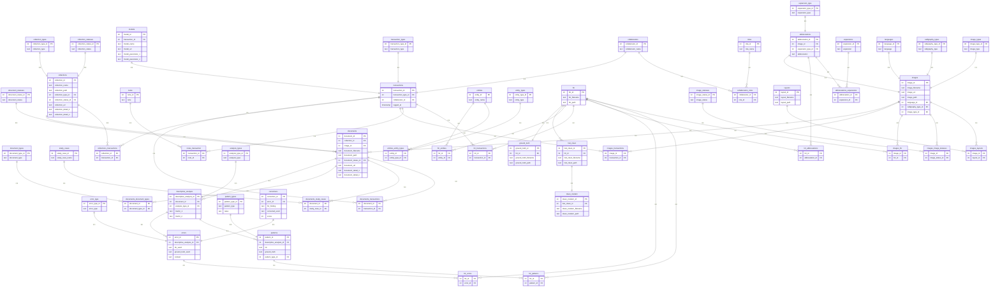

![[visualization/webcontent/amoxcailab.domain/assets/svg/data_model/data_model.svg | 1200]]

````ad-info
title: data_model
collapse: closed


```mermaid

erDiagram
    %% --- TABLAS PRINCIPALES Y DE CATÁLOGO ---
    document_types {
        int document_type_id PK
        text document_type
    }

    document_statuses {
        int document_status_id PK
        text document_status
    }

    study_cases {
        int study_case_id PK
        text study_case_name
    }

    documents {
        int document_id PK
        int collection_id FK
        int image_id FK
        text document_filename
        text document_path
        int document_status_id FK
        text document_url
        text document_detail_1
        text document_detail_n
    }

    collection_types {
        int collection_type_id PK
        text collection_type
    }

    collection_statuses {
        int collection_status_id PK
        text collection_status
    }

    collections {
        int collection_id PK
        text collection_name
        text collection_path
        int collection_type_id FK
        int collection_status_id FK
        text collection_url
        text collection_detail_1
        text collection_detail_n
    }

    models {
        int model_id PK
        int transaction_id FK
        text model_name
        text model_url
        text model_parameter_1
        text model_parameter_n
    }

    notes {
        int note_id PK
        text note
    }

    transaction_types {
        int transaction_type_id PK
        text transaction_type
    }

    collaborators {
        int collaborator_id PK
        text collaborator_name
    }

    roles {
        int role_id PK
        text role_name
    }

    transactions {
        int transaction_id PK
        int transaction_type_id FK
        int collaborator_id FK
        timestamp logged_at
    }

    entities {
        int entity_id PK
        text entity_name
    }

    entity_types {
        int entity_type_id PK
        text entity_type
    }

    abbreviations {
        int abbreviation_id PK
        int image_id FK
        int expansion_type_id FK
        text abbreviation
    }

    expansion_type {
        int expansion_type_id PK
        text expansion_type
    }

    expansions {
        int expansion_id PK
        text expansion
    }

    errors {
        int error_id PK
        int descriptive_analysis_id FK
        text htr_word
        text ground_truth_word
        text context
    }

    error_type {
        int error_type_id PK
        text error_type
    }

    htr {
        int htr_id PK
        text htr_filename
        text htr_path
    }

    ground_truth {
        int ground_truth_id PK
        int htr_id FK
        text ground_truth_filename
        text ground_truth_path
    }

    hist_clean {
        int hist_clean_id PK
        int htr_id FK
        text hist_clean_filename
        text hist_clean_path
    }

    clean_modern {
        int clean_modern_id PK
        int hist_clean_id FK
        text clean_modern_filename
        text clean_modern_path
    }

    languages {
        int language_id PK
        text language
    }

    calligraphy_types {
        int calligraphy_type_id PK
        text calligraphy_type
    }

    image_types {
        int image_type_id PK
        text image_type
    }

    image_statuses {
        int image_status_id PK
        text image_status
    }

    images {
        int image_id PK
        text image_filename
        text image_url
        text image_path
        int language_id FK
        int calligraphy_type_id FK
        int image_type_id FK
    }

    analysis_types {
        int analysis_type_id PK
        text analysis_type
    }

    layouts {
        int layout_id PK
        text layout_filename
        text layout_path
    }

    descriptive_analysis {
        int descriptive_analysis_id PK
        int document_id FK
        int analysis_type_id FK
        text metric_1
        text metric_n
    }

    patterns {
        int pattern_id PK
        int descriptive_analysis_id FK
        text htr
        text ground_truth
        int pattern_type_id FK
    }

    pattern_types {
        int pattern_type_id PK
        text pattern_type
        text rules
    }

    corrections {
        int correction_id PK
        int error_id FK
        text htr_finding
        text corrected_word
        int score
    }

    %% --- TABLAS DE CONEXIÓN (n:n) ---
    documents_document_types {
        int document_id FK
        int document_type_id FK
    }
    documents_study_cases {
        int document_id FK
        int study_case_id FK
    }
    documents_transactions {
        int document_id FK
        int transaction_id FK
    }
    collections_transactions {
        int collection_id FK
        int transaction_id FK
    }
    images_transactions {
        int image_id FK
        int transaction_id FK
    }
    notes_transaction {
        int transaction_id FK
        int note_id FK
    }
    collaborators_roles {
        int collaborator_id FK
        int role_id FK
    }
    htr_entities {
        int htr_id FK
        int entity_id FK
    }
    entities_entity_types {
        int entity_id FK
        int entity_type_id FK
    }
    htr_transactions {
        int htr_id FK
        int transaction_id FK
    }
    htr_abbreviations {
        int htr_id FK
        int abbreviation_id FK
    }
    abbreviations_expansions {
        int abbreviation_id FK
        int expansion_id FK
    }
    htr_errors {
        int htr_id FK
        int error_id FK
    }
    htr_patterns {
        int htr_id FK
        int pattern_id FK
    }
    images_htr {
        int image_id FK
        int htr_id FK
    }
    images_image_statuses {
        int image_id FK
        int image_status_id FK
    }
    images_layouts {
        int image_id FK
        int layout_id FK
    }

    %% --- RELACIONES ---
    collections ||--o{ documents : "1:n"
    images ||--o{ documents : "1:n"
    abbreviations ||--|| images : "1:1"
    models ||--|| transactions : "1:1"
    descriptive_analysis ||--o{ errors : "1:n"
    hist_clean ||--|| clean_modern : "1:1"
    corrections ||--|| errors : "1:1"
    
    collection_types ||--|| collections : "1:1"
    collection_statuses ||--|| collections : "1:1"
    document_statuses ||--|| documents : "1:1"
    transaction_types ||--|| transactions : "1:1"
    collaborators ||--|| transactions : "1:1"
    languages ||--|| images : "1:1"
    calligraphy_types ||--|| images : "1:1"
    image_types ||--|| images : "1:1"
    documents ||--o{ descriptive_analysis : "1:n"
    analysis_types ||--|| descriptive_analysis : "1:1"
    descriptive_analysis ||--o{ patterns : "1:n"
    pattern_types ||--|| patterns : "1:1"
    error_type ||--|| errors : "1:1"
    expansion_type ||--|| abbreviations : "1:1"
    htr ||--|| ground_truth : "1:1"
    htr ||--o{ hist_clean : "1:n"

    %% Relaciones n:n mediante tablas de unión
    documents ||--o{ documents_document_types : "n:n"
    document_types ||--o{ documents_document_types : "n:n"
    documents ||--o{ documents_study_cases : "n:n"
    study_cases ||--o{ documents_study_cases : "n:n"
    documents ||--o{ documents_transactions : "n:n"
    transactions ||--o{ documents_transactions : "n:n"
    collections ||--o{ collections_transactions : "n:n"
    transactions ||--o{ collections_transactions : "n:n"
    images ||--o{ images_transactions : "n:n"
    transactions ||--o{ images_transactions : "n:n"
    transactions ||--o{ notes_transaction : "n:n"
    notes ||--o{ notes_transaction : "n:n"
    collaborators ||--o{ collaborators_roles : "n:n"
    roles ||--o{ collaborators_roles : "n:n"
    htr ||--o{ htr_entities : "n:n"
    entities ||--o{ htr_entities : "n:n"
    entities ||--o{ entities_entity_types : "n:n"
    entity_types ||--o{ entities_entity_types : "n:n"
    htr ||--o{ htr_transactions : "n:n"
    transactions ||--o{ htr_transactions : "n:n"
    htr ||--o{ htr_abbreviations : "n:n"
    abbreviations ||--o{ htr_abbreviations : "n:n"
    abbreviations ||--o{ abbreviations_expansions : "n:n"
    expansions ||--o{ abbreviations_expansions : "n:n"
    htr ||--o{ htr_errors : "n:n"
    errors ||--o{ htr_errors : "n:n"
    htr ||--o{ htr_patterns : "n:n"
    patterns ||--o{ htr_patterns : "n:n"
    images ||--o{ images_htr : "n:n"
    htr ||--o{ images_htr : "n:n"
    images ||--o{ images_image_statuses : "n:n"
    image_statuses ||--o{ images_image_statuses : "n:n"
    images ||--o{ images_layouts : "n:n"
    layouts ||--o{ images_layouts : "n:n"
```
````